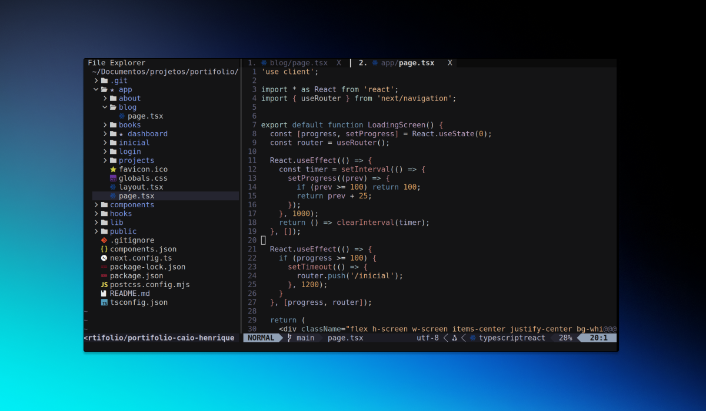

<!DOCTYPE html>
<html lang="pt-br">
<head>
<meta charset="UTF-8">
<meta name="viewport" content="width=device-width, initial-scale=1.0">
<title>Documentação — nvim-config</title>

</head>
<body>

<h1>Minhas Configurações do Neovim (nvim-config)</h1>

Bem-vindo à documentação oficial das minhas configurações <strong>nvim-config</strong>, uma personalização moderna, produtiva e minimalista do Neovim, criada para oferecer uma experiência semelhante ao VS Code, mas com toda a leveza e flexibilidade do Vim.

<h2 class="section">📦 1. Introdução</h2>

A configuração <strong>nvim-config</strong> foi criada para desenvolvedores que buscam:

<ul>
    <li>Performance extrema (Neovim + Lua)</li>
    <li>Autocompletar inteligente com LSP</li>
    <li>Interface organizada e intuitiva</li>
    <li>Ambiente otimizado para TypeScript, Python, Go, Rust e ML</li>
    <li>Terminal integrado, tree view, bufferline e muito mais</li>
</ul>

<h2 class="section">🚀 2. Instalação</h2>

<h3>2.1 Pré-requisitos</h3>
<pre><code>sudo apt update
sudo apt install git curl neovim
</code></pre>

<h3>2.2 Instalação Automática</h3>
<pre><code>git clone https://github.com/caiohenriquefranca/nvim-config.git ~/nvim-config
cd ~/nvim-config
./install.sh
</code></pre>

<h3>2.3 O Script Realiza:</h3>

<ul>
<li>Backup de pastas antigas</li>
<li>Instalação dos plugins</li>
<li>Configuração automática dos LSPs via Mason</li>
</ul>

<h2 class="section">📁 3. Estrutura da Configuração</h2>

<pre><code>~/.config/nvim/
├── init.vim
├── lua/
│   ├── bufferline_config.lua
│   ├── explorer.lua
│   ├── lsp_config.lua
│   ├── lualine_config.lua
│   ├── telescope_config.lua
│   └── terminal_config.lua
└── install.sh
</code></pre>

<h2 class="section">🔍 4. Busca de Arquivos e Texto (Telescope)</h2>

<h3><strong>Resumo da Implementação</strong></h3>

<ul>
<li><strong>Plugin Principal:</strong> telescope.nvim — fuzzy finder moderno do Neovim</li>
<li><strong>Performance:</strong> ripgrep + fd garantindo buscas instantâneas</li>
<li><strong>Filtro em tempo real:</strong> Extensão <code>telescope-fzf-native</code></li>
<li><strong>Modularidade:</strong> Configuração em <code>lua/telescope_config.lua</code></li>
</ul>

<h3>Pré-requisitos (Linux)</h3>

<pre><code>sudo apt install ripgrep fd-find
mkdir -p ~/.local/bin
ln -s $(which fdfind) ~/.local/bin/fd
</code></pre>

<h3>Atalhos (usando &lt;Leader&gt; = Espaço)</h3>

<table>
<tr><th>Atalho</th><th>Ação</th></tr>
<tr><td>&lt;Leader&gt;ff</td><td>Buscar arquivos</td></tr>
<tr><td>&lt;Leader&gt;fg</td><td>Buscar texto (Live Grep)</td></tr>
<tr><td>&lt;Leader&gt;fG</td><td>Buscar palavra sob o cursor</td></tr>
<tr><td>*</td><td>Realçar palavra no arquivo atual</td></tr>
</table>

<h2 class="section">⌨️ 5. Atalhos de Teclado</h2>

<table>
<tr><th>Atalho</th><th>Ação</th></tr>
<tr><td>&lt;Leader&gt;e</td><td>Abrir explorer</td></tr>
<tr><td>&lt;Leader&gt;t</td><td>Terminal integrado</td></tr>
<tr><td>Ctrl + h</td><td>Buffer anterior</td></tr>
<tr><td>Ctrl + l</td><td>Próximo buffer</td></tr>
</table>

<h2 class="section">🛠️ 6. Troubleshooting</h2>

<h3>Plugins não carregam</h3>
<pre><code>:PlugInstall
</code></pre>

<h3>LSP não inicia</h3>
<pre><code>:Mason
</code></pre>

<h2>📚 Créditos</h2>

Criado por <strong>Caio Henrique França Valentim</strong>.  
Projeto em constante evolução.

</body>
</html>
